# Checklist
- [x] Crear servidor que suba los datos mediante Python
- [x] Identificar nodo mediante base de datos
- [x] CRUD en la base de datos desde Firebase a la local
- [x] Interfaz gráfica vinculado con la base de datos de manera bidireccional
- [x] Actualizar base de datos al recibir un cambio
- [x] Enviar alerta por SMS cuando el umbral sea superado
- [x] Establecer la Raspberry en modo router
- [ ] Usar la interfaz GSM para salida a internet
- [x] Enviar pulso por el transector
# Instalación y configuración de dependencias 
***NOTA:*** Todos los comandos se deben ejecutar como usuario de bajos privilegios. 
1. Actualización completa del sistema.
```bash
 sudo apt-get update
 sudo apt-get full-upgrade
```
2. La librería oficial de Firebase necesita `Rust` para funcionar correctamente, este lenguaje de programación no viene instalado por defecto en la Raspberry, por ende, en necesario su instalación de la siguiente manera:
```bash
curl --proto '=https' --tlsv1.2 -sSf https://sh.rustup.rs | sh
```
El anterior comando descarga el script de instalación de `Rust` al cual solamente en necesario darle siguiente (opciones por defecto). Una vez terminado el proceso de instalación es necesario añadir al `PATH` la ruta de instalación de `Rust` y reiniciar el sistema, para ello, ejecutar el siguiente comando.
```bash
source $HOME/.cargo/env
sudo reboot
```
3. Instalación del motor de base de datos MySQL (mariadb)
```bash
sudo apt install mariadb-server
```
4. Instalación de dependencias de Python
```python
pip install pytz firebase_admin mysql-connector-python twilio python-crontab
```
O alternativamente se puede usar el archivo `requirements.txt` de este repositorio de la siguiente manera:
```python
pip install -r requirements.txt
```
5. Instalación de `RaspAP` para configurar la Raspberry en modo router. 
```bash
curl -sL https://install.raspap.com | bash
```
El anterior comando descarga el script de instalación de `RaspAP` al cual solamente en necesario darle siguiente (opciones por defecto). Una vez terminado el proceso de instalación se reiniciará el sistema.
# Configuración de la Raspberry
## Configuración de la base de datos
1. En primer lugar es necesario establecer una instalación segura de mysql de la siguiente manera:
```bash
sudo mysql_secure_installation
```
Al ejecutar este comando se deberá establecer una contraseña para el usuario `root`.
2. Una vez terminada la instalación segura se deberá crear un nuevo usuario y una nueva base de datos de la siguiente manera
```bash
sudo mariadb -p
```
En el panel de mariadb se ejecutan las siguientes consultas reemplazando `dbname` por el nombre de la base de datos, `username` por el nombre del usuario de bajos privilegios del sistema y `password` por la respectiva contraseña para dicho usuario.
```sql
CREATE DATABASE <dbname>;
CREATE USER '<username>'@'%' IDENTIFIED BY '<password>';
GRANT ALL PRIVILEGES ON <dbname>.* TO '<username>'@'%';
FLUSH PRIVILEGES;
```
3. Una vez terminado este proceso se importan las tablas necesarias para el funcionamiento del proyecto. Para ello se usa el archivo `nodos.sql` guardado en la carpeta `backups/nodos.sql` de este repositorio.
```bash
mariadb <usuername> -p <dbmane> < nodos.sql
```
4. Finalmente, se debe exponer el servicio MySQL a la red local. Lo anterior se consigue editando el archivo de configuración de `mariadb-server`
```bash
sudo nano /etc/mysql/mariadb.conf.d/50-server.cnf
```
Una vez abierto el editor de texto se debe buscar la dirección `127.0.0.1` y reemplazarla por `0.0.0.0` y guardar los cambios. Por último, se debe reiniciar el servicio MySQL para tener las nuevas configuraciones
```bash
sudo systemctl restart mariadb
```


## Configuración de RaspAP
1. Acceder a través de un navegador a http://localhost en caso de hacerlo desde la Raspberry o acceder a http://10.3.141.1 en caso de hacerlo desde un dispositivo externo. Para acceder desde un dispositivo externo es necesario que dicho dispositivo este conectado a la red WiFi creada por la Raspberry llamada `raspi-webgui` que tiene contraseña `ChangeMe`. 
2. Una vez se ingrese al portal web pedirá las siguientes credenciales:
**Username:** admin
**Password:** secret
3. Una vez adentro se realizará las siguientes configuraciones (NO OLVIDAR DESPUES DE CADA CONFIGURACIÓN REALIADA GUARDAR CAMBIOS):
Cambio del nombre de la red WiFi

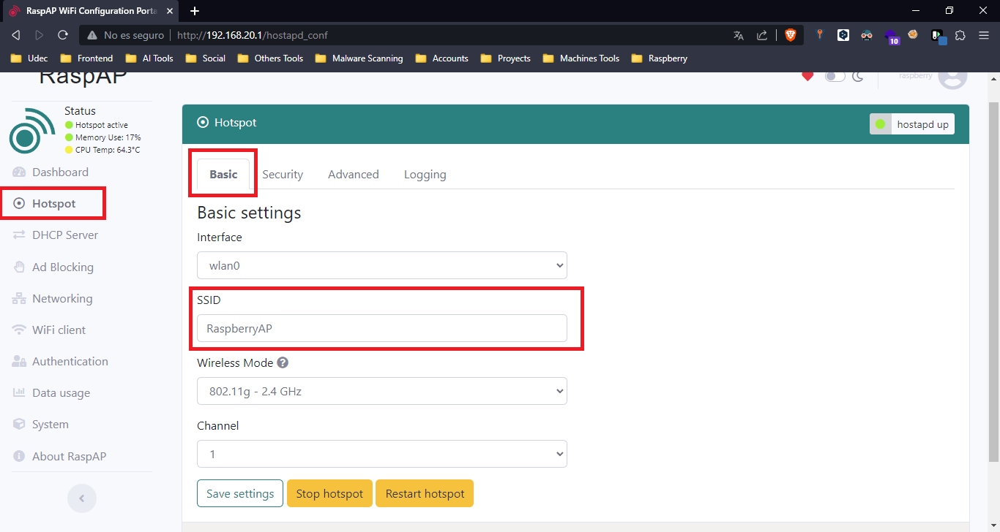
Cambio de la contraseña de la red WiFi

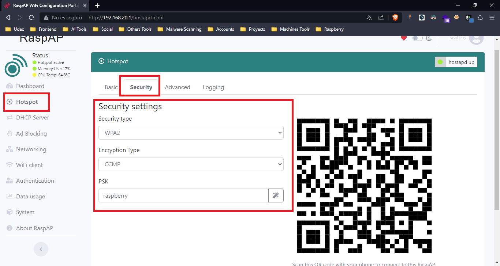
Cambio de la región

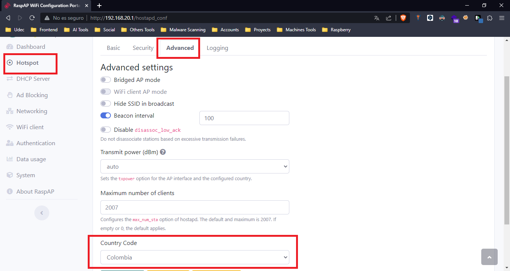
Cambio de la dirección IP del router que se crea a través de la interfaz inalámbrica 

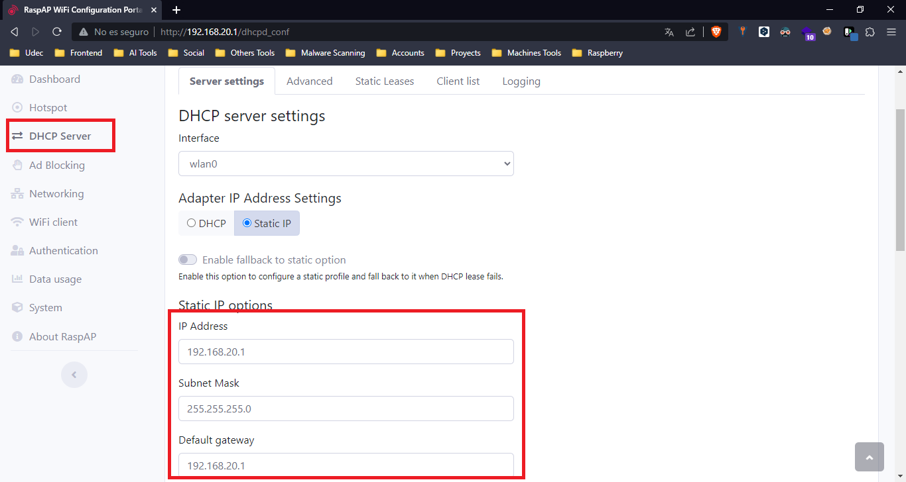
Cambio de las direcciones IP que se asignarán por DHCP a los diferentes cienetes

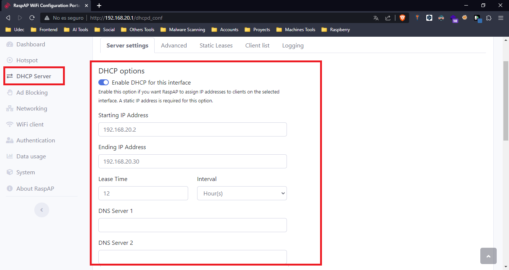
Cambio del usuario y contraseña para acceder al panel administrativo

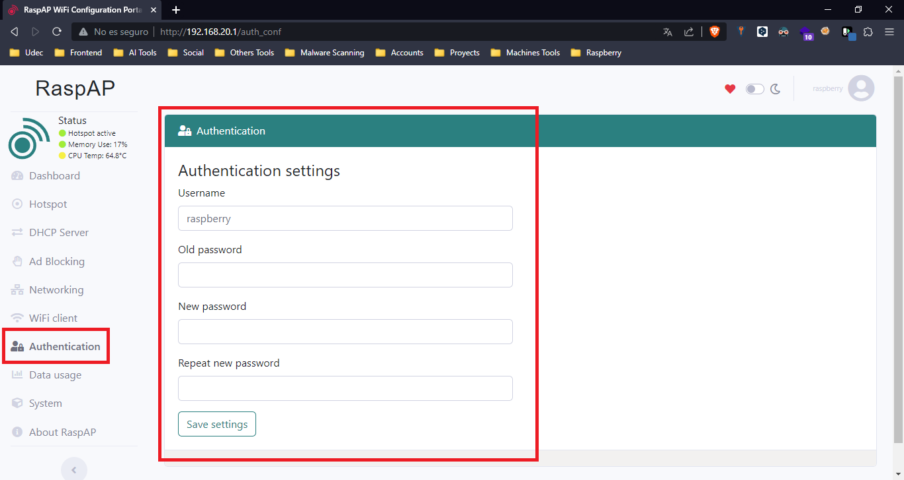
## Configuración del UART5 de la Raspberry
Para comunicar la Raspberry con el módulo HC12 se hace necesario configurar los pines  32 y 33 en la UART5 como TX y RX respectivamente, para ello se debe editar el siguiente fichero:
```bash
sudo nano /boot/config.txt
```
y agregar en la última línea `dtoverlay=uart5`. Además a través de `sudo raspi-config` se debe habilitar el puerto serie de la siguiente manera:

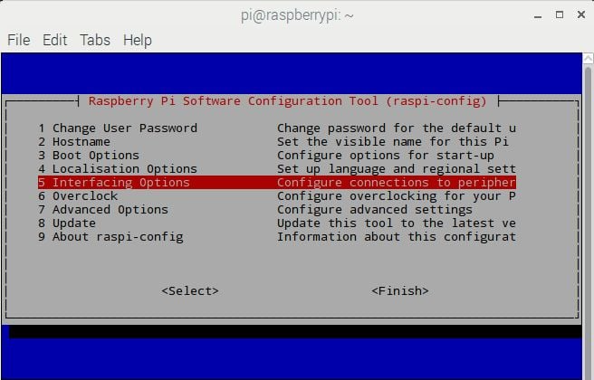
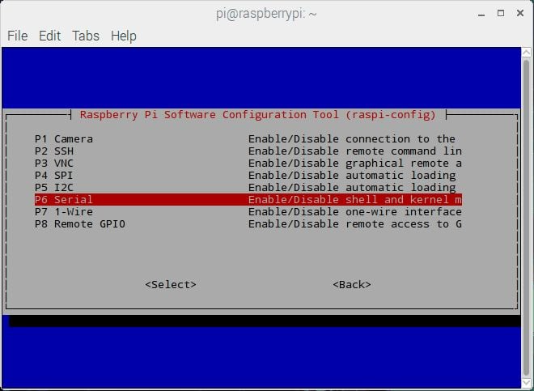
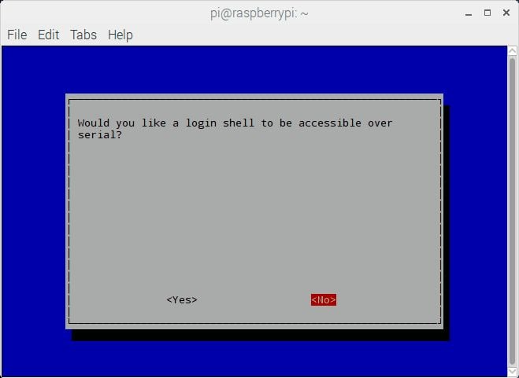
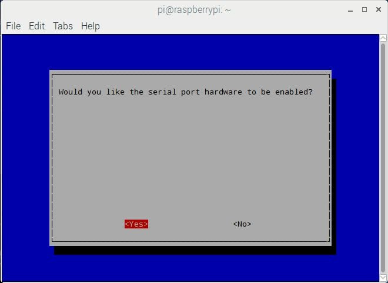
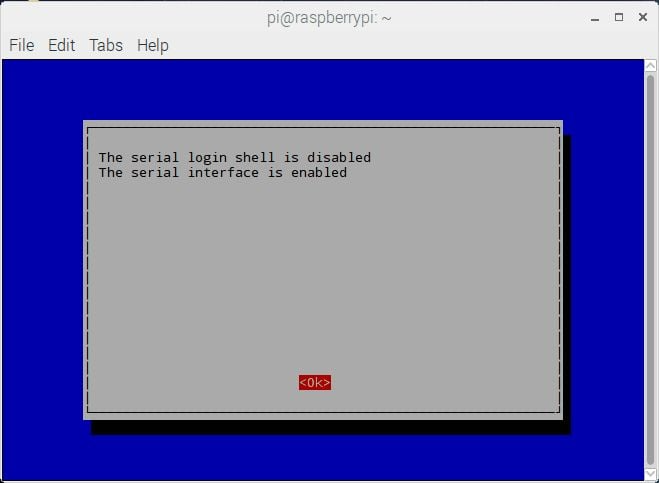

Posteriormente la Raspberry se reiniciará y estará disponible los pines 32 y 33 en la UART5 como TX y RX respectivamente a través de `/dev/ttyAMA1`.
## Configuración de tareas Cron y otros Scripts
Para que las tareas Cron funcionen el proyecto se debe encontrar en una carpeta llamada `Proyecto` en el escritorio del usuario con bajos privilegios.
1. Se debe añadir dos tareas cron con el comando
```bash
crontab -e
```
Una vez abierto el editor se debe BORRAR TODOS LOS COMENTARIOS y añadir las dos tareas cron presentes en el archivo `scripts/crontab.txt` al FINAL del archivo.
2. Se debe dar permisos de ejecución al script `start_services`, que es el que se encarga de levantar el servidor http y el listener de Firebase.
```bash
chmod +x $HOME/Desktop/Proyecto/scripts/start_services.sh
```

# Cambio de algunos parámetros en los scripts
- **Cambio de puerto del servidor:** para cambiar el puerto del servidor http basta con editar la línea **6** del archivo `server.py` ubicado en la carpeta `services/server.py`. Por defecto el servidor está en el puerto 8080. 
- **Cambio de número telefónico para el envío de alertas:** para cambiar el número al cual se envían las alertas vía SMS basta con editar la línea **11** del archivo `twilio.py` ubicado en la carpeta `services/modules/twilio.py`. En dicha línea se debe colocar en un `string` el número telefónico al que se desea enviar el SMS sin olvidar el prefijo +57. Antes de añadir un nuevo número debe ser verificad por la plataforma de Twilio. Para añadir un nuevo número debe ingresar ingresar a la [Consola de Twilio](https://console.twilio.com/) e iniciar sesión. Una vez adentro debe ir al siguiente apartado

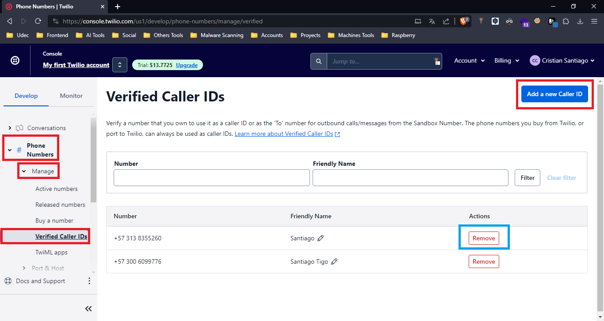

Debe dar clic en `add new Caller ID` y escribir el nuevo número telefónico, el servicio de Twilio enviará un mensaje de texto con un código que debe ser ingresado en la plataforma para verificar que sea un número activo.

# Algunas consideraciones
La estructura que debe recibir el servidor http por el método POST debe contener la cabecera `Content-Type: application/json` y la siguiente información (únicamente la `mac` es obgatoria, las demás son opcionales):

```typescript
{
	"mac": "string",
	"temp": number,
	"ha": number,
	"hs": number,
	"rad": number,
	"co2": number,
}
```
## Ejemplo de envío de datos con `curl`
- Windows
```bash
curl -X POST -H "Content-Type: application/json" -d '{"""mac""": """ae:58:ff:d5:c1:55""", """temp""":25.6, """ha""":50.36, """hs""": 72.98, """rad""":150.25, """co2""":600}' http://192.168.20.1:8080
```
- Linux
```bash
curl -X POST -H "Content-Type: application/json" -d '{"mac": "ae:58:ff:d5:c1:55", "temp":25.6, "ha":50.36, "hs": 72.98, "rad":150.25, "co2":600}' http://192.168.20.1:8080
```
